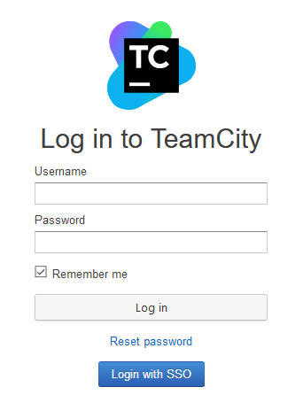
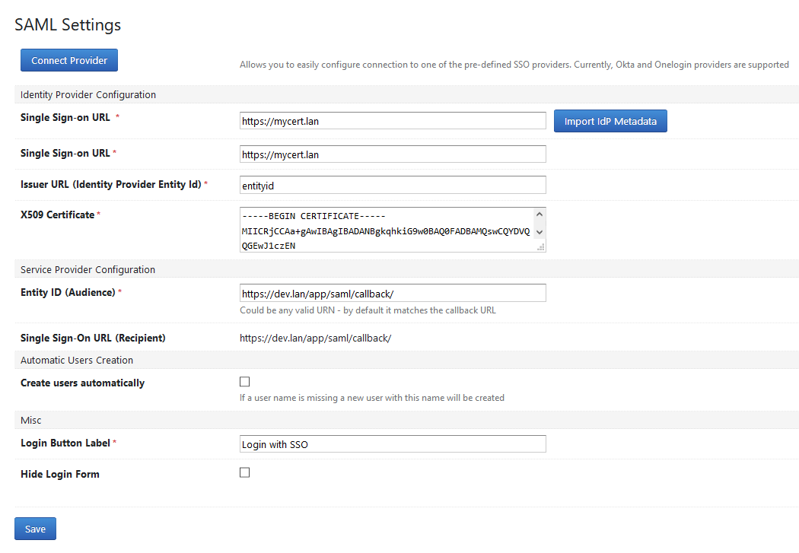
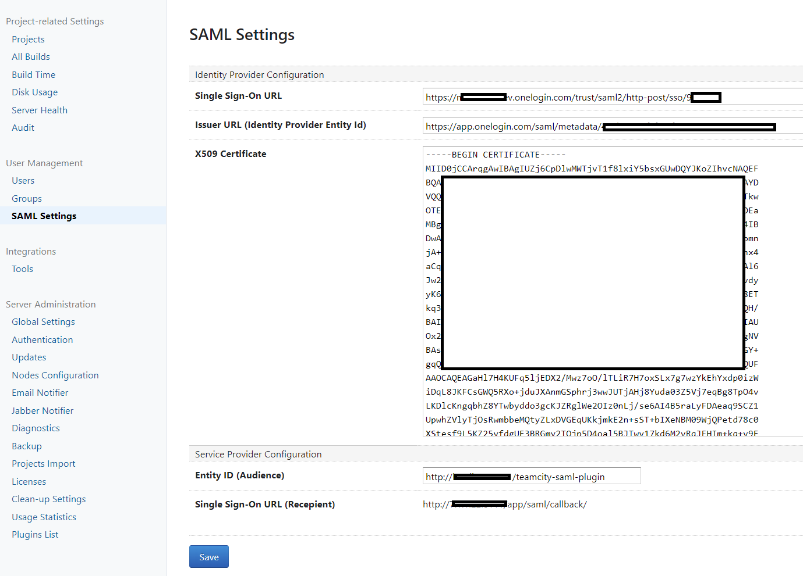

**"Hey everyone, I’m sorry to say that I can’t actively maintain this project anymore — I just don’t have the time. That said, I’m still happy to review and accept pull requests, but I won’t be writing any new code myself. Feel free to fork it and keep it going! Huge thanks to everyone who contributed and supported this project—it really means a lot!"**  

# TeamCity SAML Authentication Plug-In

[](https://github.com/morincer/teamcity-plugin-saml/actions/workflows/maven.yml)

## Overview

The plug-in adds ability to authenticate users with SAML-based SSO providers (like Okta, Onelogin etc.).

The plug-in offers the following functionality:

* Authenticate SAML assertions for existing users
* Option to automatically create users on login (you may also limit allowed user names by postfix match)
* Option to automatically assign and unassign TeamCity groups from users based on IdP group membership.
* Wizard to ease configuration of connectivity to common IdP providers  (currently - Okta and Onelogin, more to come in future)
* Option to import IdP metadata from XML
* SdP Metadata generation   

Things the plug-in does NOT currently support (but they're on the roadmap):

* Automatic IdP metadata import from URL 
* Multi-tenancy





## Installation

Grab the [latest release](https://github.com/morincer/teamcity-plugin-saml/releases/latest) follow the TeamCity installation instructions ([google](https://www.google.com/search?q=teamcity+install+plugin)).  

## Configuration

The plugin has been tested with Okta and Onelogin but should work fine with other SAML v2 Identity Providers.

* Login as administrator and go to Administration > Authentication

* Switch to advanced mode and add module **HTTP-SAML.v2**


* Under User Management click **SAML Settings**

* Specify values for all the fields in the **Identity Provider Configuration** section. These values are usually shown when configuring SAML SSO connection for your particular identity provider. 



* Use values from the **Service Provider Configuration** section when configuring SAML SSO connection on the identity provider side.

Please refer the example of set up for [Okta](./docs/OktaSetup.md) if you need some details.

* Make sure you have properly set up users on the TeamCity side - their usernames should match the SAML assertion name ID (usually - e-mail). 

* (Optional) Review CORS configuration - the plugin adds exception to the Teamcity's CORS filter - if request is POST sent to the SAML login callback URL and it contains a SAML message - it is considered CORS safe. If such behavior is by some reason is not acceptable the filter exception can be disabled on the plugin configuration page (Misc -> CORS Filter Exception checkbox) 

* Logout and click the "Login with SSO" button to test. 

The SAML authentication sequence is a following:

1. When you click the "Login with SSO" button you are redirected to your IdP login page
1. You enter credentials on the login screen, your IdP validates them and, if all is fine, posts a signed SAML-assertion XML to the SSO login callback (<YOUR_SITE>/app/saml/callback/)
1. The assertion contains name ID of the user (usually - e-mail). Plugin searches for users having the same username (not e-mail!) and, if the user is found, authenticates the request. 

### Automatic Users Creation and Custom Attributes Mapping

You have an option to create users automatically upon first successful login and provision their data basing on SAML assertion attributes.

In this case you must explicitly specify the source for user full name, VCS username, e-mail and groups. Valid options are:

* None - no value
* Name ID - value is taken from the NameId attribute
* Custom Attribute - value is taken from the specified custom attribute
* Expression - value is taken by evaluating a custom expression.

 Expression is based on [Spring Expression Language (SpEL)](https://docs.spring.io/spring-framework/docs/3.2.x/spring-framework-reference/html/expressions.html)
 syntax and framework thus allowing to build quite a powerful statements. The context of the expression execution is a HashMap containing (the list is to be extended in future):

* NameId - under *nameid* key
* LastAssertionId - under *lastassertionid* key
* All the custom attributes - mapped by their respective names. Single value attributes are mapped as strings, multi-valued attributes - as lists of strings.

To reference an attribute in the expression you can either use it's key directly (if the attribute name conforms to standard Java variable naming conventions) 
or by calling *get('attribute name')* function, which effectively does the same.

**Note**

If the expression evaluation fails due to any reason (wrong syntax, mentioned attribute is missing from request) the user is stil being created but the respective element is considered to be empty. 

However, to ease the troubleshooting of such cases, the plugin puts into the server log:
1. Error message describing exception that lead to such behavior
2. Warning listing all available attributes.

For instance you will see something like lines below: 
```text 
[2022-01-11 17:18:16,702]  ERROR -     jetbrains.buildServer.AUTH - EL1008E: Property or field 'fullName' cannot be found on object of type 'java.util.HashMap' - maybe not public or not valid?
org.springframework.expression.spel.SpelEvaluationException: EL1008E: Property or field 'fullName' cannot be found on object of type 'java.util.HashMap' - maybe not public or not valid?
	at org.springframework.expression.spel.ast.PropertyOrFieldReference.readProperty(PropertyOrFieldReference.java:229)
	at org.springframework.expression.spel.ast.PropertyOrFieldReference.getValueInternal(PropertyOrFieldReference.java:97)
    ... stack trace...
   
[2022-01-11 17:18:16,703]   WARN -     jetbrains.buildServer.AUTH - Available properties are: lastassertionid, FullName, nameid
```

**Expression Examples:**

**Concatenate firstName and lastName**

Assuming we've got custom attributes named firstName and lastName in SAML assertion.
```spel
firstName + ' ' + lastName
```

**Concatenate firstName and lastName using get**

Assuming we've got custom attributes named First Name and Last Name in SAML assertion.
```spel
get('First Name') + ' ' + get('Last Name')
```

### Group mapping

The plugin can optionally support adding users to TeamCity groups based on IdP group membership.

The mapping between IdP group and TeamCity group is perfomed on the TeamCity groups `Key` value, with the matching being case insensitive.

See the [Okta Group Mapping](./docs/OktaGroupMapping.md) doc for an example of how to set this up.

### Secondary Node Authentication Support

The plugin supports execution on secondary server instances (nodes) (read [official documentation](https://www.jetbrains.com/help/teamcity/multinode-setup.html) for details). However, few limitations apply:

1. You are not allowed to change the plugin settings from the secondary node admin UI (as per JetBrains recommendation)
1. You should manually configure IdP to send SAML assertion to the secondary node URL (or deal with redirection on the load balancer/proxy level)

### Examples

* [Azure AD (Microsoft Azure Active Directory)](docs/AzureAd.md)

## Troubleshooting

### Additional Logging

General troubleshooting step is to enable debug auth logging in Teamcity and check the log output for possible clues. 

You may use pre-crafted [logging preset](./docs/debug-auth-saml.xml): just import it into your TC (Server Administration -> Diagnostics -> Logging Presets tab) and switch the logging profile (Server Administration -> Diagnostics -> Troubleshooting tab). This preset is naturally just a copy of standard debud-auth.xml preset + com.onelogin.saml2 debug logging.

The log file would be named "teamcity-auth.log" and in most situations it will give you some ideas on what is wrong.  

### Invalid_response error on login

This is the most common issue and its root cause varies from wrong setup on IdP side to wrong networking configuration.

Possible solutions:

 * Check if configuration on IdP side is correct - especially the callback URL and entity Id. Good idea is to use SP metadata xml, generated by the plugin - you can download it on the plugin configuration page and majority if not all IdP providers allow configuration from SP metadata. 
 
 * Check if configuration on the plugin (IdP) side is correct - i.e. you use the proper certificate and name mapping. It's also a good idea to import IdP metadata instead of manually provisioning SP settings.
 
 * Check if you're behind load balancer - SAML Strict Mode (enable by default) checks that the request URL conforms the expected callback URL (configured as Teamcity root URL). So if you don't plan to disable the SAML Strict mode (which is not recommended for production environment due to security consideration) you have to make sure if your load balancer has been configured to correctly transfer the request URL. You may check the https://github.com/onelogin/java-saml#working-behind-load-balancer for some additional information. 
 
 If nothing else helps - collect the auth log file as described above and file an issue - providing such details as:
 - Teamcity version you're running, 
 - Screenshot of the SP configuration (make sure no sensitive data like has been exposed to public) or SP metadata file
 - Screenshot of the IdP configuration or metadata file
 - teamcity-auth.log collected with the [debug-auth-saml](./docs/debug-auth-saml.xml) preset enabled (and again make sure no personal data present there - like real e-mail addresses - I don't really need them for troubleshooting)

 ## Development
 
 The plugin was built with the help of [TeamCity SDK Maven Plugin](https://github.com/JetBrains/teamcity-sdk-maven-plugin). It contains the [build](./build) folder with Maven tasks making life easier.
 
  ...Install and initialize a local TeamCity server version (controlled by teamcity-version property in the parent [pom.xml](./pom.xml)...
 
 ```bash
 mvn tc-sdk:init
 ```
 
 ...Start the server...
 ```bash
 mvn tc-sdk:start
 ```
 
 ... Build and package admin-ui
 ```bash
cd saml-authentication-server/src/main/vue/admin-ui
npm install
npm run build 
```
 
 ...Compile+package the plugin (note that it will also build and package Vue.js part of the plugin)
 ```bash 
 mvn package 
 ```

...Deploy it
```bash
mvn tc-sdk:reload
```

### Admin UI Development with Vue

The plugin's admin UI is built using Vue.js framework with Typescript and therefore supports standard Vue-cli-based toolchain.  The Vue part is located in the [vue/admin-ui](./saml-authentication-server/src/main/vue/admin-ui) sub-folder of the plugin and contains it's own package.json file with all the needed dependencies and basic build commands. 

To start the built-in Vue server just use
```bash
npm run serve 
```
And navigate to http://localhost:8080 (to see the admin UI as a standalone controls) or http://localhost:8080/#/demo - to see it in the Teamcity-like design.
