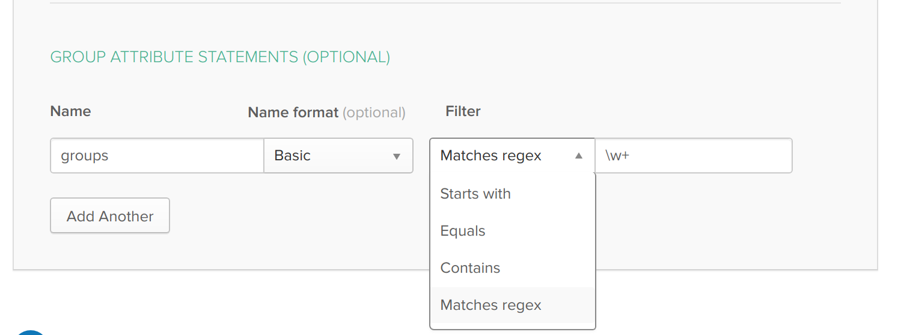
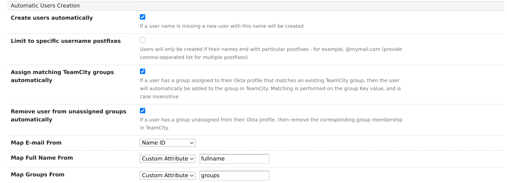
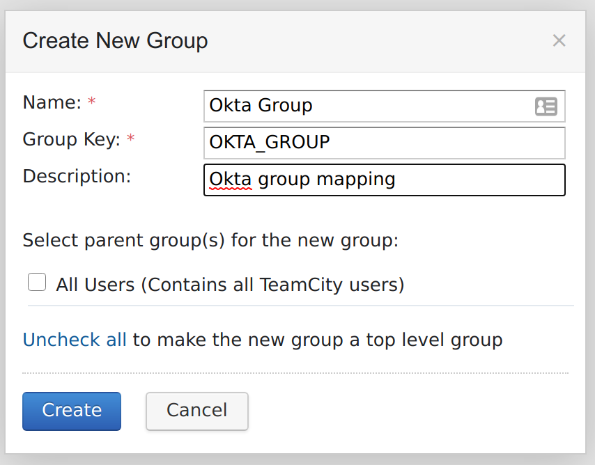
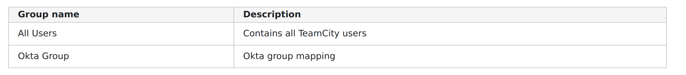

# Mapping Okta IdP Groups to TeamCity using SAML Authentication

This step-by-step guide outlines the setup required in order to manage TeamCity group membership using Okta group assigment.

## Pre-requisites

* You have completed the initial setup for using Okta IdP with TeamCity as defined in the Okta Setup [guide](OktaSetup.md)

## Step 1. Add groups SAML attribute to Okta app

Login to the Okta developer console and naviate to the TeamCity application created in the pre-requisite steps.

Edit the integration, and on the `Configure SAML` screen, populate the `Group Attribute Statements` section:

Give the attribute a name - e.g. `groups`.

Select the appropriate `Filter` that matches your requirements. If you want _all_ the assigned Okta groups to be passed through to TeamCity, then select the `Matches regex` filter and add the following regex: `\w+`.

Save the new application configuration.

## Step 2. Associate users to required groups

Create any Okta groups that are required, and map users to the new group.

## Step 3. Configure TeamCity to assign groups from the SAML response.

In TeamCity, navigate to the `SAML Settings` page.

Ensure that `Create Users Automatically` is checked, and then check the `Assign matching TeamCity groups automatically` box.
Set the `Map Groups from` field to `Custom attribute`, and populate based on the attribute name configured in step 1.

## Step 3. Create the corresponding TeamCity groups.

Create a new group in TeamCity to map the corresponding Okta group to.

The `Name` value can be whatever value you want to use, as the group matching is performed on the `Key` value.  
Therefore, ensure that the Okta group name and the TeamCity `key` match.  
**N.B:** The group matching is case insensitive, so accepting the default all uppercase TeamCity format is fine.

For example, to map an Okta group called `Okta_group` to TeamCity, create a group with the key `OKTA_GROUP`: 

## Step 4. Test

If already logged in to TeamCity, logout and then press the `Login with SSO` button.

Once logged in, confirm group membership by navigating to `My Settings & Tools` > `Groups`.

