# Setting up TeamCity SAML Authentication to Work with Okta IdP

**Update 2019-09-01** You may now use Connection Wizard - it makes things bit easier. 

This step-by-step guide outlines steps needed to make TeamCity authenticate through Okta identity provider using the SAML authentication plugin.

## Pre-requisites

* TeamCity is up and running, the SAML authentication plug-in is installed (make sure you have the **SAML Settings** menu item visible in the left navbar of the admin screen)
* You have account (developer account works) in Okta (if not - get one at [developer.okta.com](https://developer.okta.com))

## Parameters Used

* <TEAMCITY_HOSTNAME> - the host name of the server TeamCity runs on (i.e. https://teamcity.mydomain.com)
* <USER_EMAIL> - E-mail of the user we are going to authenticate 

## Step 1. Set up user in TeamCity

Login to TeamCity as Administrator and go to Administration -> Users and click "Create user account"

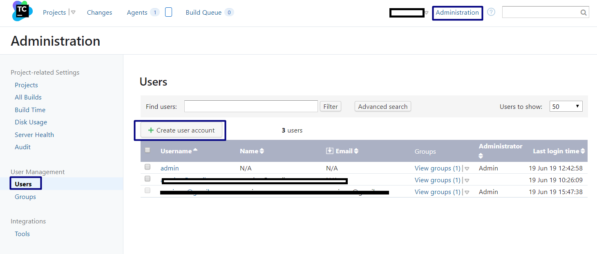

Use <USER_EMAIL> as the username and fill in the rest of the details as (if) needed.

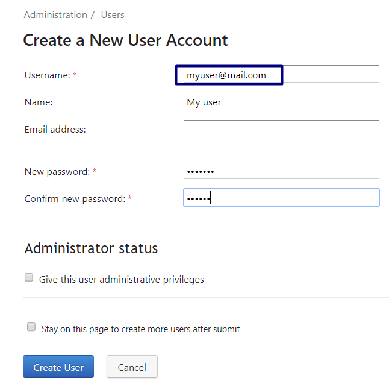

## Step 2. Enable SAML Authentication

Navigate to Administration -> Authentication and click the "Switch to advanced mode" link

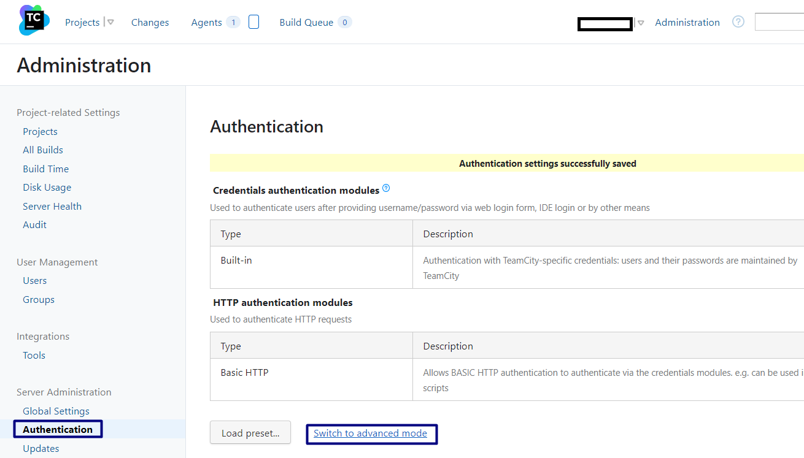

Click the "Add Module" button and choose the **HTTP-SAML.v2** module, press the "Add" button to commit.


## Step 3. Set up Okta

Login to the Okta developer console. Switch it to the Classic UI mode.

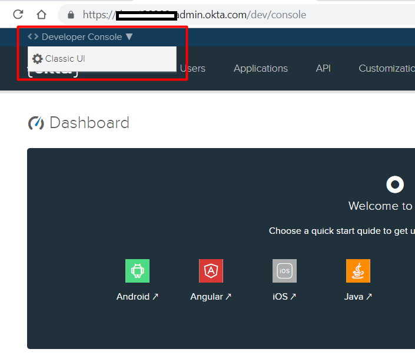

Click the "Add Applications" link on the right navbar

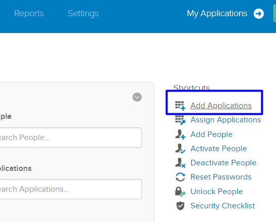

Click the "Create New App" button, in the pop-up choose "SAML 2.0" as Sign-on method and click the "Create" button

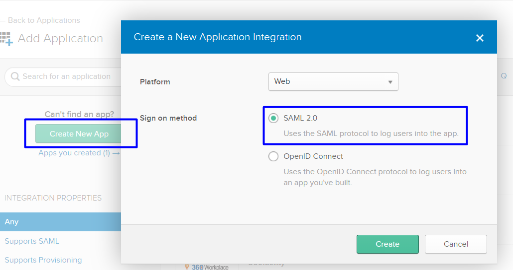

Name the application as you need, setup logo etc. and click the "Next" button to configure SAML parameters.

Important things Okta asks you to provide are (the particular field names may differ for other IdP but the main purpose remains the same):

**Single Sign-on URL** - the URL to wich Okta will send the SAML authorization information once user logins successfully

**Audience URI (SP Entity ID)** - Unique identifier of your SAML consumer (TeamCity instance in our case)  

The rest of fields are used to control various aspects of the authentication process (like the field to be used by Okta as the user ID) but we will skip it here and will use the default values. 

Keep the Okta browser window open and get back to the TeamCity administration page. Click the **SAML Settings** link and check the bottom of the page (the **Service Provider Configuration** section).

There you will see the Entity ID (Audience) and Single Sign-On URL (Recepient) fields. 
Copy the values of these fields into the Audience URI (SP Entity ID) and Single Sign-on URL fields of the Okta SAML setup page respectively.

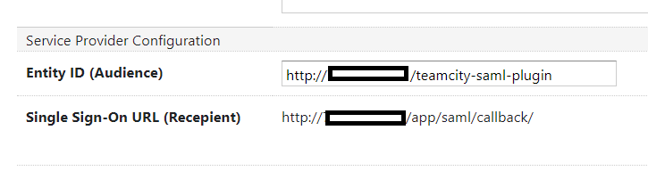

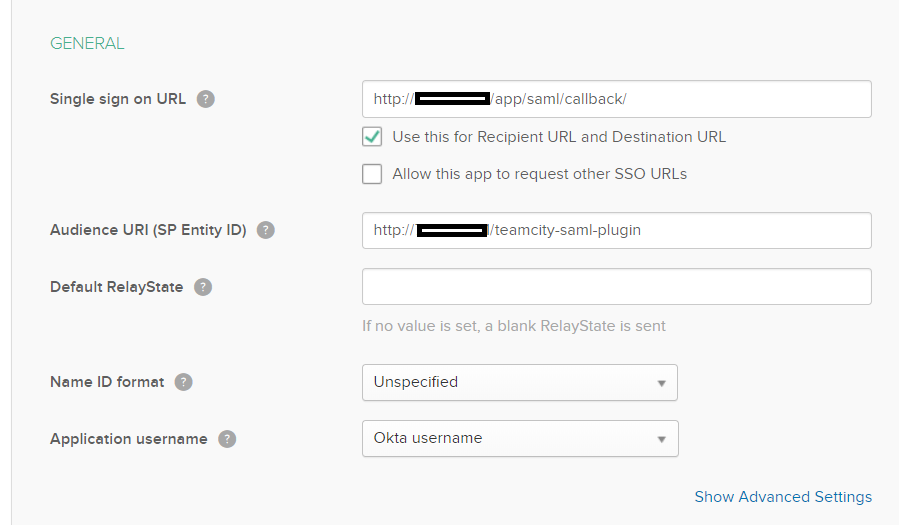 

Keep the rest of Okta fields at their default values, press next and finish. 

You are redirected to the Sign On tab of the application configuration. Click the View Setup Instructions button

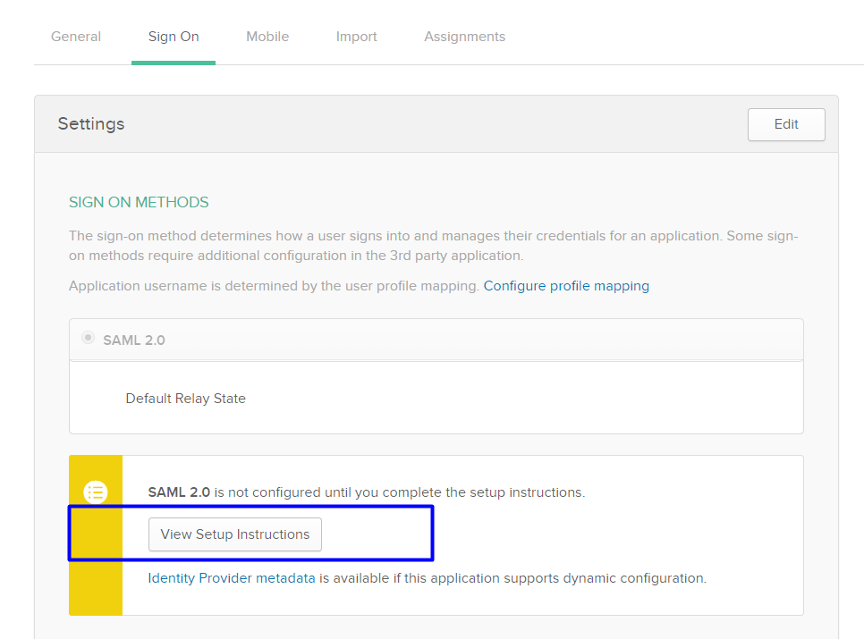   

You will see the page with data you will need to copy into TeamCity -> SAML Settings fields.

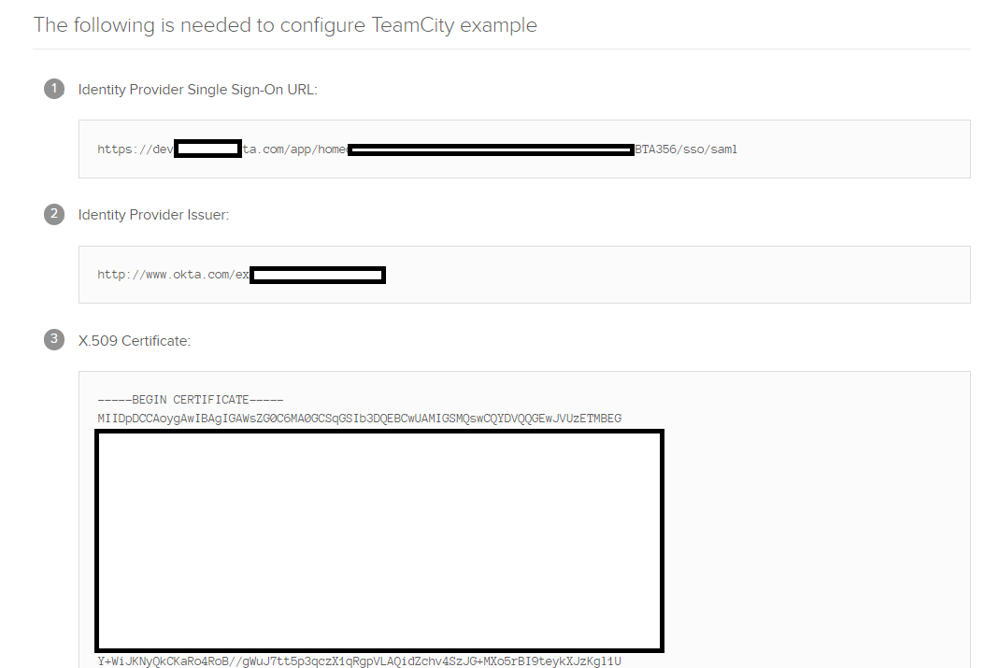

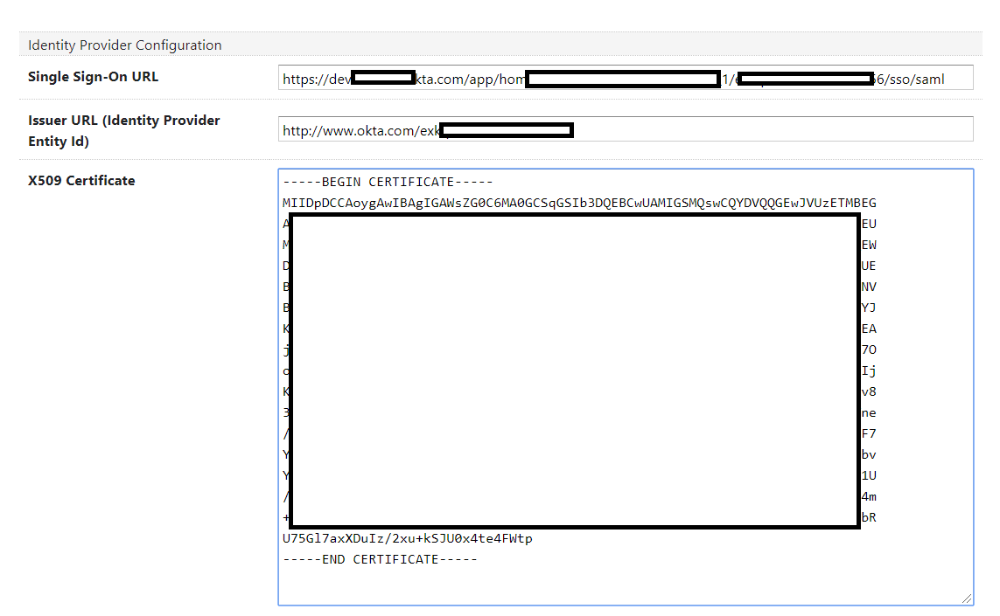

Almost there...

## Step 4. Setup Okta User

You now need to setup Okta user which corresponds to the TeamCity user.

Navigate to Okta -> Directory -> People and click Add Person. Specify the profile data you need but don't forget to set the username to the same e-mail (<USER_EMAIL>) you used in the Step 1. 

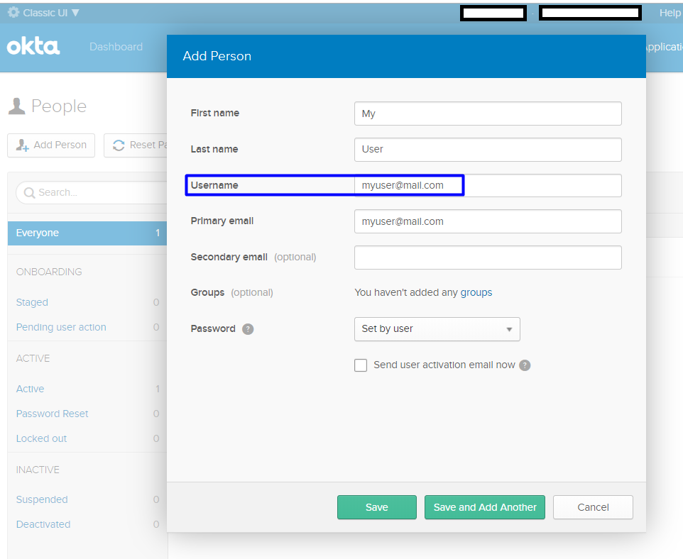 

Click Save, click on the user again and click the "Assign Applications" button.
Choose the application you've just created and activate the user.

## Step 5. Test

Logout from Okta.  

Navigate to TeamCity, logout and press the "Login with SSO" button. 

In the Okta login screen provide credentials of the user you've just created. You should now be logged into the TeamCity.

If you see a message like: 
```
403 Forbidden: Responding with 403 status code due to failed CSRF check: request's "Origin" header value "null" does not match Host/X-Forwarded-Host header values or server's CORS-trusted hosts, consider adding "Origin: ..." header.  
 ```

Then you have CORS enabled for your TeamCity instance and it prevents POSTs from IdP domain to the TeamCity web controllers. 

To add the origin as allowed login to TeamCity as administrator, go to the Adminstration -> Diagnostics -> Internal Properties -> Edit internal property

and add/edit line:

```
rest.cors.origins=<value of the request origin in the error message> 
```
In my case the origin is null - as I'm not using SSL for the dev environments.

Like this:
```
rest.cors.origins=null
```


 
  

